# ecolife

<!-- A new Flutter project.

## Getting Started

This project is a starting point for a Flutter application.

A few resources to get you started if this is your first Flutter project:

- [Lab: Write your first Flutter app](https://docs.flutter.dev/get-started/codelab)
- [Cookbook: Useful Flutter samples](https://docs.flutter.dev/cookbook)

For help getting started with Flutter development, view the
[online documentation](https://docs.flutter.dev/), which offers tutorials,
samples, guidance on mobile development, and a full API reference. -->
# 🌱 EcoLife – Sürdürülebilir Yaşam Asistanı

**EcoLife**, bireylerin sürdürülebilir yaşam alışkanlıkları geliştirmesini sağlayan yapay zeka destekli bir mobil asistandır. Kullanıcıların beslenme ve ulaşım tercihlerine çevreci alternatifler sunarken, akıllı tarif önerileri, kişiselleştirilmiş yaşam haritası ve karbon puanı sistemiyle günlük rutinlerini optimize eder. Eğitim içerikleriyle farkındalık kazandırır, topluluk desteğiyle motive eder ve bilinçli tüketimi teşvik ederek çevre dostu bir yaşamı erişilebilir kılar

---

## 🚀 Özellikler

- 🔐 **Kayıt Ol / Giriş Yap**: Kullanıcıların güvenli şekilde hesap oluşturması ve giriş yapması
- 🏠 **Ana Ekran**: Kullanıcıyı genel bilgilerle karşılayan merkez ekran
- 🍳 **Akıllı Mutfak**: Kullanıcının elindeki malzemelere göre sürdürülebilir tarifler önerir
- 📚 **Eğitim Ekranı**: Sürdürülebilirlik ve çevre bilinciyle ilgili videolar izlenebilir
- 🗺️ **Yaşam Haritası**: Yapay zeka, kullanıcının aradığı mekanlarla ilgili konumları ve türevlerini sunar
- 👥 **Topluluk Ekranı**: Kullanıcılar tarif paylaşabilir, yorum yapabilir, etkinliklere katılabilir
- 🚲 **Yeşil Ulaşım**: Kullanıcının tercihlerine göre en uygun çevreci ulaşım aracını önerir
- 📦 **QR / Manuel Ürün Ekleme**: Eklenen ürün hakkında yapay zeka ile sürdürülebilirlik ve karbon ayak izi bilgisi verir
- 👤 **Profil ve Skorlar**: Kullanıcının başarıları, karbon ayak izi skoru ve kişisel gelişimi takip edilir

---

## 📸 Uygulama Görselleri

Giriş-kayıt Ekranı:  
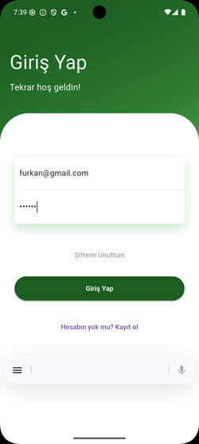  

Ana Ekran:  
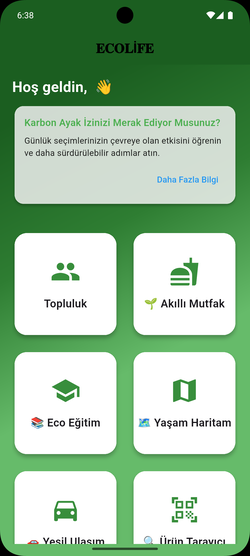

topluluk:  
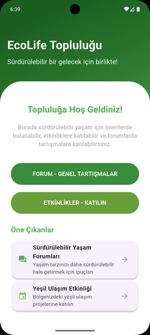
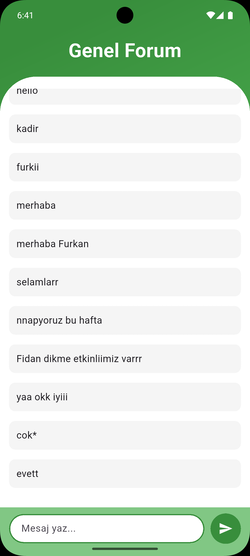
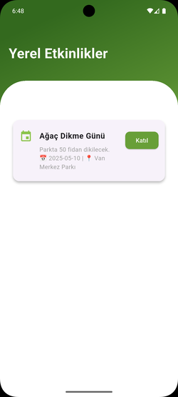


Akıllı Mutfak -Tarif Önerileri:  
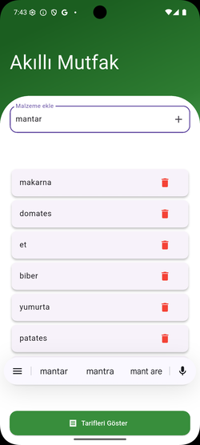
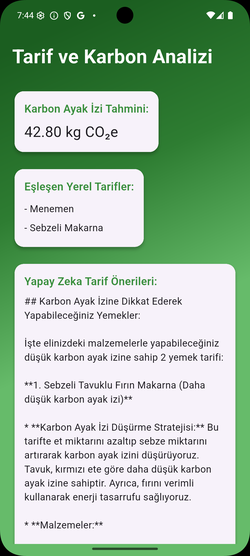


Yaşam Haritası:  

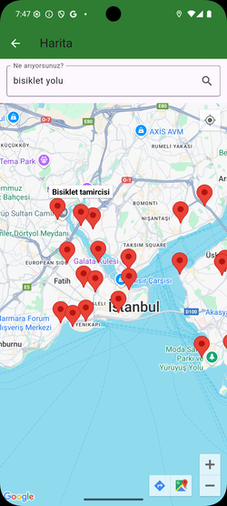


Yeşil Ulaşım:  
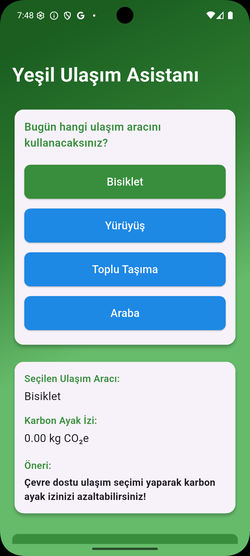
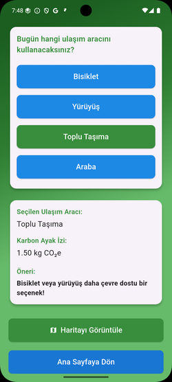


Ürün Bilgisi:  
 

Profil-skor:  
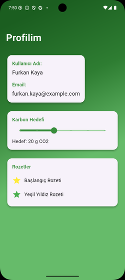
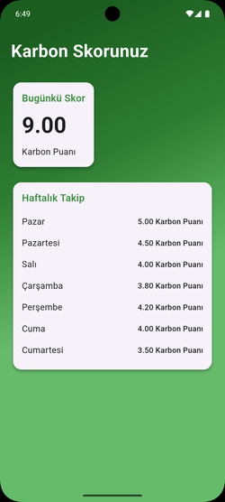


---

## 🎥 Tanıtım Videosu

[YouTube'da İzle](https://youtu.be/WGD-bWtONIs)

---

## 🛠️ Kurulum

```bash
git clone https://github.com/kullaniciAdi/ecolife.git
cd ecolife
flutter pub get
flutter run
