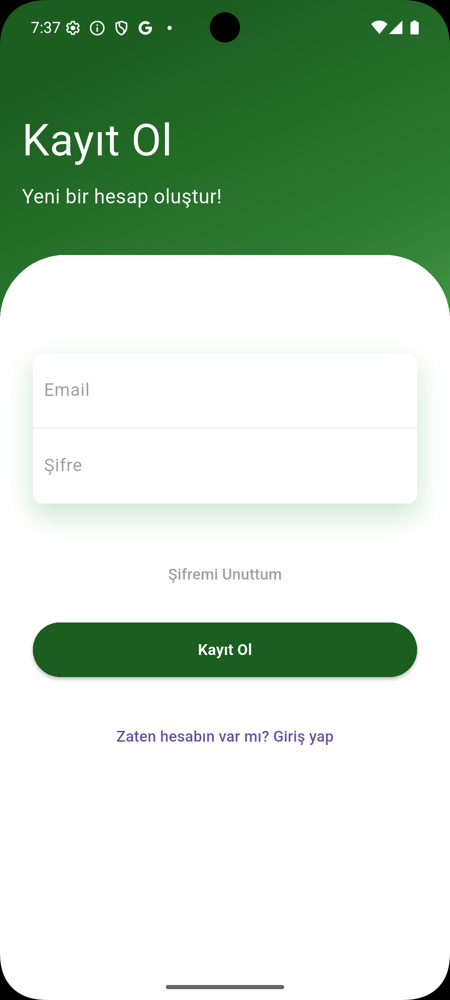
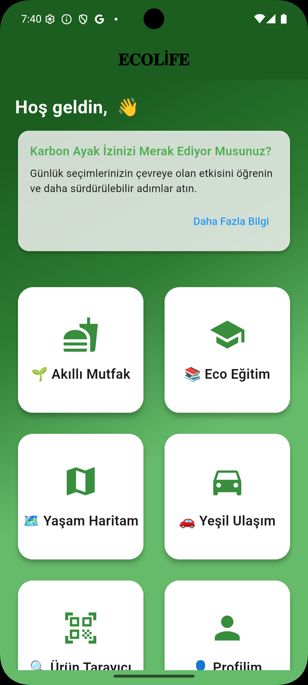
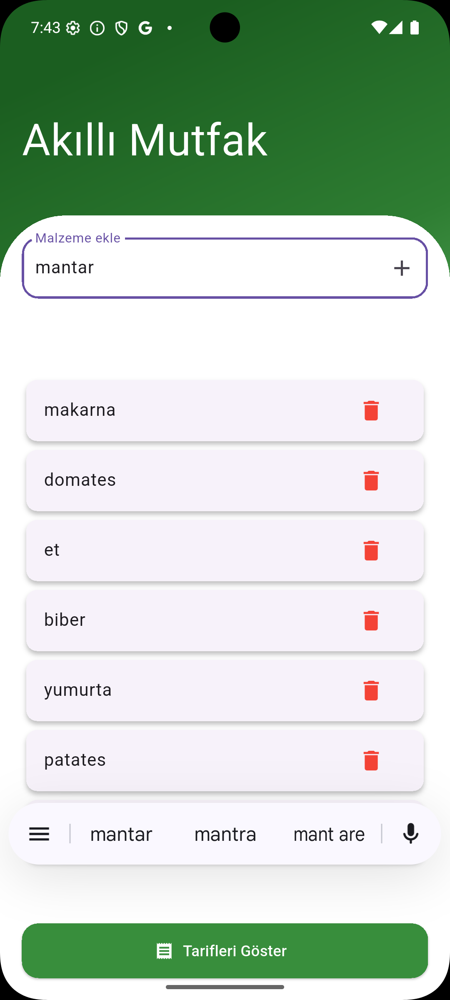
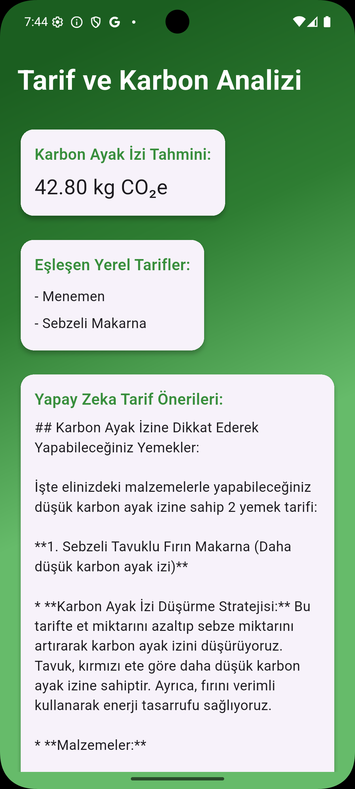
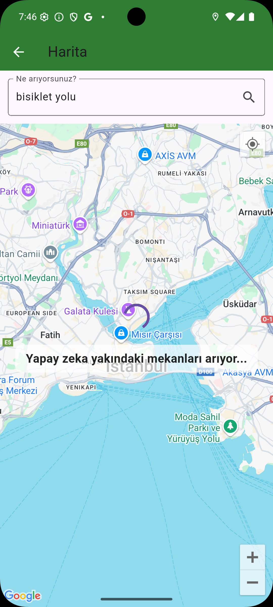
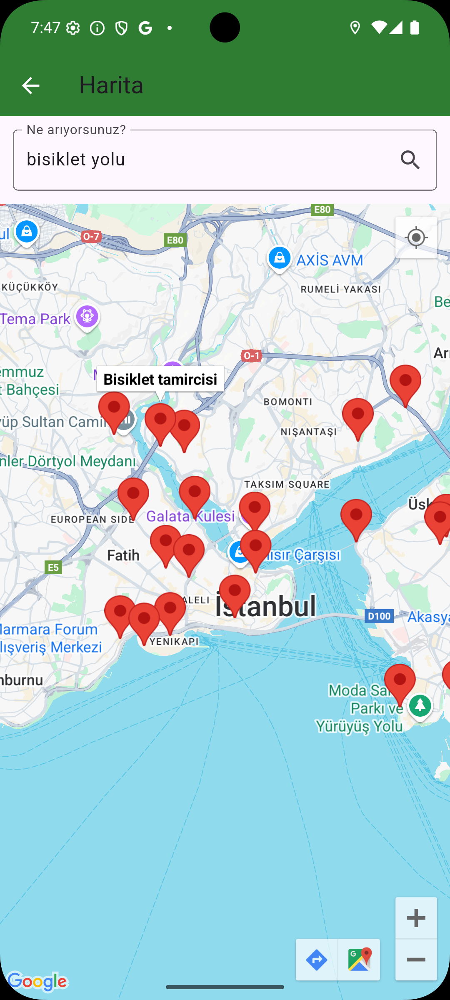
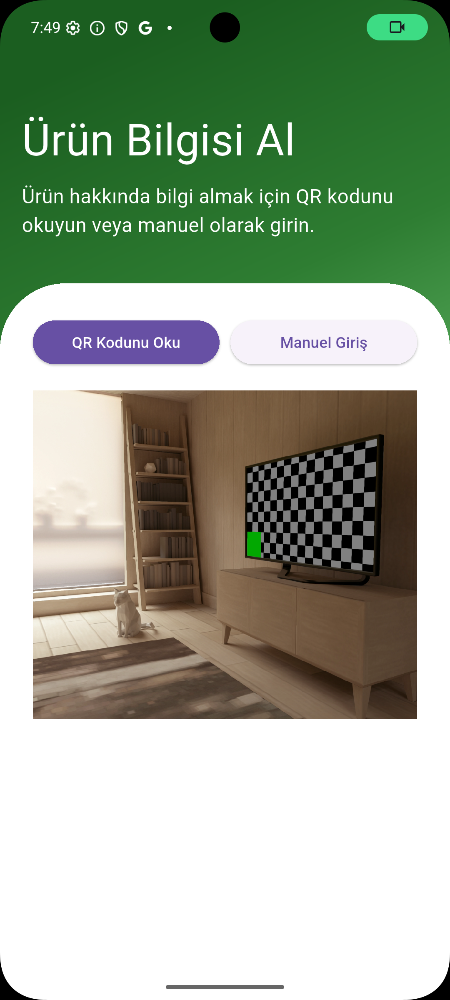
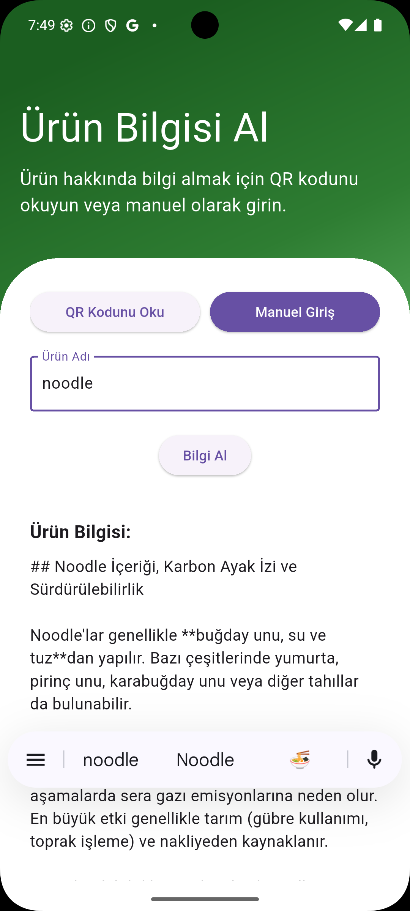

# ecolife

<!-- A new Flutter project.

## Getting Started

This project is a starting point for a Flutter application.

A few resources to get you started if this is your first Flutter project:

- [Lab: Write your first Flutter app](https://docs.flutter.dev/get-started/codelab)
- [Cookbook: Useful Flutter samples](https://docs.flutter.dev/cookbook)

For help getting started with Flutter development, view the
[online documentation](https://docs.flutter.dev/), which offers tutorials,
samples, guidance on mobile development, and a full API reference. -->
# 🌱 EcoLife – Sürdürülebilir Yaşam Asistanı

**EcoLife**, bireylerin sürdürülebilir yaşam alışkanlıkları geliştirmesine yardımcı olan bir mobil uygulamadır. Yapay zeka destekli özellikleriyle kullanıcıların karbon ayak izini azaltmasına, daha çevreci tercihler yapmasına ve sürdürülebilir bir yaşam tarzı benimsemesine katkı sağlar.

---

## 🚀 Özellikler

- 🔐 **Kayıt Ol / Giriş Yap**: Kullanıcıların güvenli şekilde hesap oluşturması ve giriş yapması
- 🏠 **Ana Ekran**: Kullanıcıyı genel bilgilerle karşılayan merkez ekran
- 🍳 **Akıllı Mutfak**: Kullanıcının elindeki malzemelere göre sürdürülebilir tarifler önerir
- 📚 **Eğitim Ekranı**: Sürdürülebilirlik ve çevre bilinciyle ilgili videolar izlenebilir
- 🗺️ **Yaşam Haritası**: Yapay zeka, kullanıcının aradığı mekanlarla ilgili konumları ve türevlerini sunar
- 🚲 **Yeşil Ulaşım**: Kullanıcının tercihlerine göre en uygun çevreci ulaşım aracını önerir
- 📦 **QR / Manuel Ürün Ekleme**: Eklenen ürün hakkında yapay zeka ile sürdürülebilirlik ve karbon ayak izi bilgisi verir
- 👤 **Profil ve Skorlar**: Kullanıcının başarıları, karbon ayak izi skoru ve kişisel gelişimi takip edilir

---

## 📸 Uygulama Görselleri

Giriş Ekranı:  

kayıt Ekranı:  


Ana Ekran:  


Akıllı Mutfak:  


Tarif Önerileri:  


Yaşam Haritası:  

Yaşam Haritası:  



Yeşil Ulaşım:  

Yeşil Ulaşım:  


Ürün Bilgisi:  

Ürün Bilgisi:  

Profil:  


---

## 🎥 Tanıtım Videosu

[YouTube'da İzle](https://www.youtube.com/watch?v=örnekVideoID)

---

## 🛠️ Kurulum

```bash
git clone https://github.com/kullaniciAdi/ecolife.git
cd ecolife
flutter pub get
flutter run
